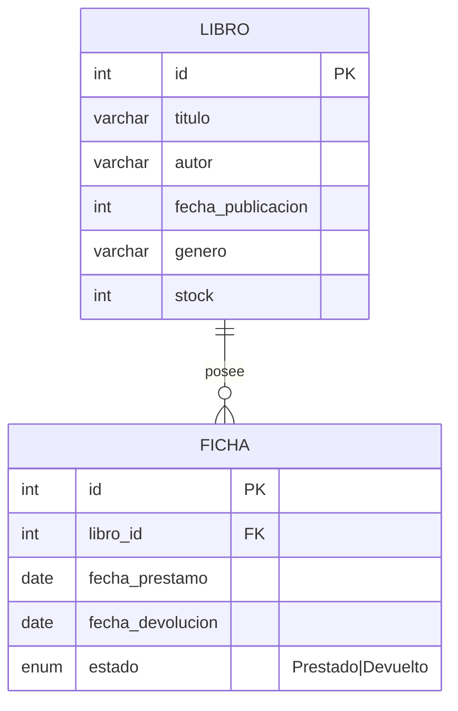

# BibliotecaPDF

Elias Manuel Nuñez - tzanu007@gmail.com

Biblioteca

Permite a los usuarios pedir prestado un libro de los que se encuentran disponible en la bibilioteca.

A continuación hay un DER de la bbbdd, y se crea automáticamente al ejecutar la aplicación.

